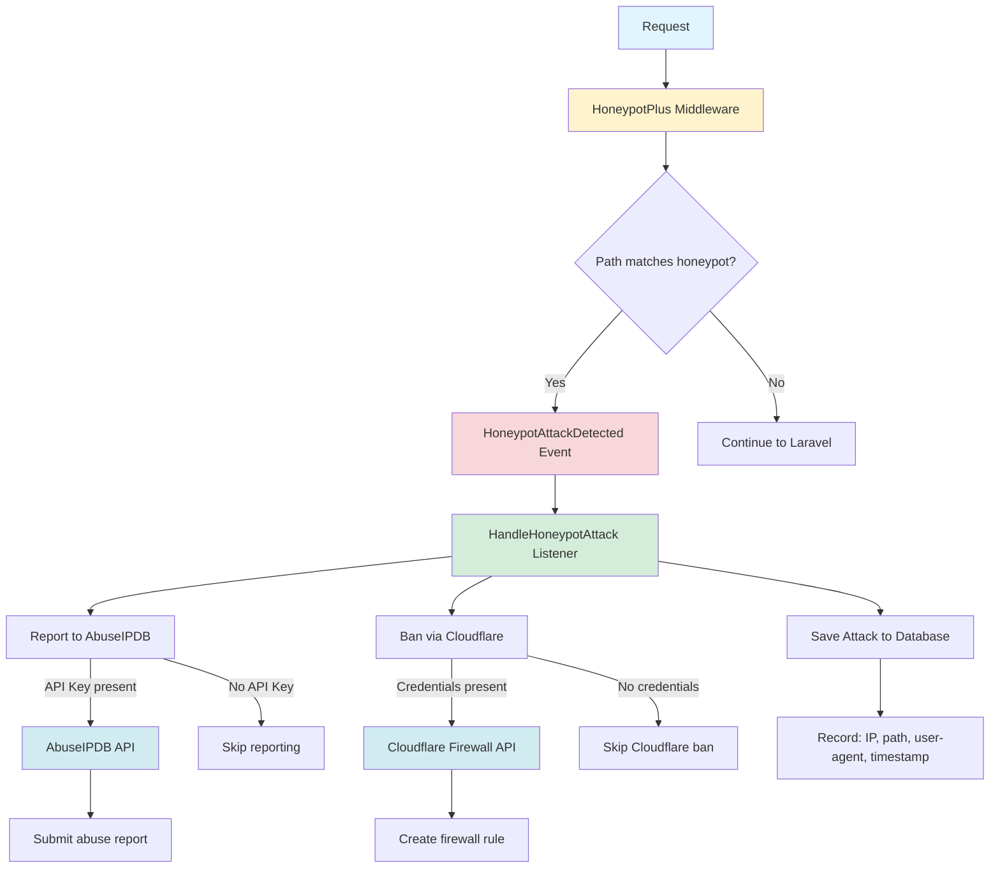

# HoneypotPlus for Laravel

A Laravel package that detects malicious IPs attempting to access sensitive files/paths, bans them via Cloudflare, reports them to AbuseIPDB, and provides an interactive CLI management interface.

> **Note**: This package is **not** a form honeypot. For form honeypot protection, consider using [spatie/laravel-honeypot](https://github.com/spatie/laravel-honeypot). HoneypotPlus focuses on detecting malicious reconnaissance attempts on sensitive paths like `.env`, `.git`, `wp-admin`, etc.

[](https://github.com/ilogus/laravel-honeypotplus/actions?query=workflow%3ATests+branch%3Amain)
[](https://codecov.io/gh/ilogus/laravel-honeypotplus)
[](https://github.com/ilogus/laravel-honeypotplus/blob/main/LICENSE)

## Features

- **Honeypot Detection**: Detect malicious IP access attempts on sensitive paths (`.env`, `wp-admin`, etc.)
- **Cloudflare Integration**: Automatically ban IPs via Cloudflare Firewall Rules
- **AbuseIPDB Reporting**: Automatically report malicious IPs to AbuseIPDB
- **Automatic Cleanup**: Scheduled task to unban expired bans
- **Interactive CLI**: Manage blocked IPs with `php artisan honeypot-plus:manage`
- **Event-Driven**: Clean architecture using Laravel's Event/Listener system
- **Zero Configuration**: Features auto-enable when API keys are present

## Requirements

- PHP 8.3 or higher
- Laravel 12.x or 13.x

## Installation

```bash
composer require ilogus/laravel-honeypotplus
```

Install the package:

```bash
php artisan honeypot-plus:install
```

This will:
- Publish the configuration file to `config/honeypot-plus.php`
- Publish the migration file to `database/migrations/`

## Configuration

The package works out of the box with default settings. To customize, edit the published configuration file:

```bash
config/honeypot-plus.php
```

### Environment Variables

Add the following to your `.env` file:

```bash
# Enable or disable the package
HONEYPOT_PLUS_ENABLE=true

# Enable logging
HONEYPOT_PLUS_LOGGING=true

# Ban duration in hours (default: 24)
HONEYPOT_PLUS_BAN_DURATION_HOURS=24

# Cloudflare (optional - auto-enables when both are set)
HONEYPOT_PLUS_CLOUDFLARE_API_TOKEN=your_cloudflare_api_token
HONEYPOT_PLUS_CLOUDFLARE_ZONE_ID=your_zone_id

# AbuseIPDB (optional - auto-enables when set)
HONEYPOT_PLUS_ABUSEIPDB_KEY=your_abuseipdb_api_key

# Cleanup schedule (default: daily)
HONEYPOT_PLUS_SCHEDULE_CLEANUP=daily
```

### Getting Cloudflare API Token

1. Go to [Cloudflare Dashboard](https://dash.cloudflare.com/)
2. Navigate to **My Profile** → **API Tokens**
3. Create a token with **Edit** permission for **Zone** → **Firewall Rules**
4. Copy the token

### Getting AbuseIPDB API Key

1. Sign up at [AbuseIPDB](https://www.abuseipdb.com/)
2. Navigate to **API** section
3. Copy your API key

## Usage

### Middleware

Add the middleware to your application to intercept malicious requests before Laravel's routing:

```php
// In bootstrap/app.php
use HoneypotPlus\Middleware\HoneypotPlusMiddleware;

return Application::configure(basePath: dirname(__DIR__))
    ->withRouting(
        //
    )
    ->withMiddleware(function (Middleware $middleware) {
        $middleware->append(HoneypotPlusMiddleware::class); // add the middleware
    })
    ->withExceptions(function (Exceptions $exceptions) {
        //
    })->create();
```

> **Important**: Use `append()` to ensure the honeypot middleware runs *before* Laravel's routing. Otherwise, Laravel will return a 404 page for non-existent routes instead of allowing the honeypot to detect and block malicious IPs.

### Custom Honeypot Rules

In `config/honeypot-plus.php`, you can customize the honeypot patterns:

```php
'honeypots' => [
    // Static routes
    '/.env',
    '/wp-admin',
    '/.git',

    // Regex patterns (prefix with 'regex:')
    'regex:/^\.env\./i',
    'regex:/wp-config\.php$/i',
],
```

### CLI Management

List and manage blocked IPs interactively:

```bash
php artisan honeypot-plus:manage
```

Available actions:
- List blocked IPs
- Ban an IP manually
- Unban an IP
- Show statistics

### Manual Ban/Unban via Facade

```php
use HoneypotPlus\Facades\HoneypotPlus;

// Ban an IP for 24 hours
HoneypotPlus::ban('192.168.1.1', 24);

// Check if an IP is banned
if (HoneypotPlus::isBanned('192.168.1.1')) {
    // IP is banned
}

// Unban an IP
HoneypotPlus::unban('192.168.1.1');

// Get statistics
$stats = HoneypotPlus::getStats();
// Returns: ['total' => 10, 'active' => 5, 'expired' => 5, 'reported' => 3]
```

## Artisan Commands

| Command | Description |
|---------|-------------|
| `php artisan honeypot-plus:install` | Install the package (publish config & migration) |
| `php artisan honeypot-plus:manage` | Interactive IP management |
| `php artisan honeypot-plus:cleanup` | Clean up expired bans (runs automatically) |

## Automatic Scheduling

The cleanup command is automatically registered in Laravel's scheduler. No manual configuration needed.

To verify the schedule:

```bash
php artisan schedule:list
```

## Database Schema

The package creates a `honeypot_plus_attacks` table with the following columns:

| Column | Type | Description |
|--------|------|-------------|
| `id` | bigint | Primary key |
| `ip` | string | Attacker IP address |
| `honeypot_rule` | string | Matched honeypot pattern |
| `user_agent` | string (nullable) | Request user agent |
| `http_method` | string | Request method (GET, POST, etc.) |
| `path_requested` | string | Requested path |
| `reported_at` | timestamp (nullable) | When reported to AbuseIPDB |
| `cf_rule_id` | string (nullable) | Cloudflare rule ID |
| `expiration_at` | timestamp (nullable) | Ban expiration |
| `is_blocked` | boolean | Currently blocked |
| `already_reported` | boolean | Already reported to AbuseIPDB |
| `last_seen_at` | timestamp (nullable) | Last activity |

## Architecture

The package follows Laravel best practices with a clean, event-driven architecture:



## Testing

Run the test suite:

```bash
cd honeypotplus
composer test
```

Run with coverage:

```bash
composer test-coverage
```

## Security

If you discover a security vulnerability, please email contact@ilogus.dev.

## License

HoneypotPlus is open-source software licensed under the [MIT license](LICENSE).

## Credits

- [All Contributors](https://github.com/ilogus/laravel-honeypotplus/graphs/contributors)

## Support

- [Documentation](https://github.com/ilogus/laravel-honeypotplus)
- [Issues](https://github.com/ilogus/laravel-honeypotplus/issues)
- [Discussions](https://github.com/ilogus/laravel-honeypotplus/discussions)
